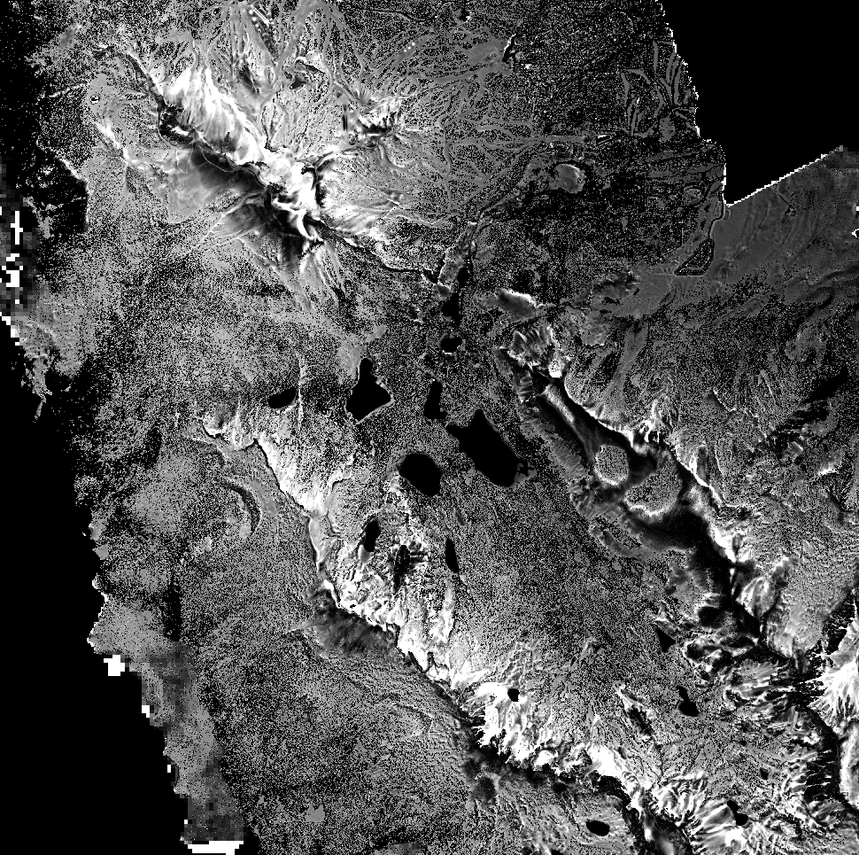

# Introduction to Scientific Programming

----

# Why do I need to know how to program?

1. Modern research pretty much requires it
2. Track your work easier
3. Avoid endless repetitive tasks that will ultimately kill your career

 **Programming is like notetaking that also does your homework.**

----
# Things We Hope you Learn

* Navigate and manipulate files in a linux environment.
* Use python to crunch numbers and do your work for you.
* Learn some tools to manage your data and codes

