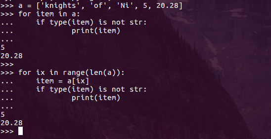

# Python for Scientists


----
## Preaching Python
Python is a high-level programming language that has rapidly become on of the most popular coding languages in the world.

 * First released in 1991 by Dutch computer mastermind Guido van Rossum
 * Most Google-serached programming language in 2018
 * Third ranked language in terms of popularity
 * Many resources, extensive documentation, and user write-ups

 This document is meant as an overview of the basic tools and knowledge that scientists should have to properly make use of Python.

----
## Why Python?
Python is

 * Free to use
 * Broad in functionality
 * Strongly rooted in clean syntax
 * Promotes clean coding practices


----
##So what can you do with python?

Pretty much anything you want

 * Software packages
 * Data analysis
 * Web development
 * Software testing
 * Compile presentations

And of course,

 * Scripting

----
## What We'll Cover

- [Resources](#resources)
- [Basics](#basics)
- [Important Packages](#important-packages)
- [Importing APIs and Docs](#importing-apis-and-docs)
- [Object Orient Programming](#object-oriented-programming)
- [Examples](#examples)

## Resources

Given Python's popularity, there are many available resources. Most problems can be answered with a quick google search. Some good resources to start are  

 * [Python's documentation](#https://docs.python.org/3/)
 * [StackOverflow](#https://stackoverflow.com/questions/tagged/python)
 * [Learn Python in 10 Minutes](#https://www.stavros.io/tutorials/python/)

----
## Basics

Python, like all programming languages, have different data types so that your
system knows what type of data it is looking at. The common types are

 * **int**
 * **float**
 * **string**
 * **list**
 * **dictionary**

One thing that is different than many other forms of programming is that the data type is implicit to the definition of the variable. For instance. Python knows that

 * ```a = 5``` is an integer
 * ```b = 27.654``` is a float
 * ```c = ['some', 'words', 'here', 6]``` is a list


----
### Strings

A string is a python datatype that stores any combination of characters and recognizes them as text. Documentation on the str class can be found at

 https://docs.python.org/3/library/stdtypes.html#str

The str class has many useful built in methods, such as *lower*, *upper*, and *replace*


----
### Lists

In Python, a list allows you to store any other datatype in an ordered fashion. Common list methods can be found at https://docs.python.org/3/tutorial/datastructures.html.

In this example, we put some integers and strings in a list, and then modify the list.


----
### Dictionaries

Dictionaries are a data structure that allow you to store an unordered combination of keys and values. A key is like an index that tells you where to find a piece of data (your value).

For instance we could create a dictionary of variables and their descriptions:

```
vars = {'snow_density' : 'Predicted average snow density',
        'specific_mass' : 'Predicted specific mass of the snowcover',
        'water_saturation': 'Predicted percentage of liquid water saturation of the snowcover'}
```

We can then find the description of a variable by using the variable name as a key


Dictionary methods can be found here

https://docs.python.org/3/tutorial/datastructures.html#dictionaries

----
## Important Packages

Taking a short break from data types, there are a few Python packages that we will frequently use in development and data analysis. These expand the base functionality of Python.

 * numpy - Array creatioon and manipulation
 * pandas - Data structure and data analysis functionality
 * matplotlib - Plotting and visualization
 * netCDF4 - Reading and writing 2D and 3D data with NetCDF files

----
### Arrays

The Python Numpy library is a must for scientific programming. Our main use for Numpy is the manipulation of 1, 2, and 3 dimensional arrays. The library makes array math quick and easy using the ```numpy.ndarray``` class. This allows us to store and manipulate rasters of snowpack and environmental variables with ease. Here is a quick example of storing and manipulating arrays.


In this example we created a random 3x3 array, replaced any value less than 0.6 with 0.0, and then summed all of the values in the array.

----
### Pandas DataFrames

Pandas is another must have library for data analysis and good science in Python. It is everything you could want in Excel, but faster and more versatile.

----
### Conditionals

Conditionals are the programmatic way to compare some value against a criteria. It is stripped down, very logical thinking.

Let's say there is a kid in an amusement park and he wants to ride the super awesome roller coaster. This kid is 1.42 meters tall (this is Python for scientists so we have to use metric). You have to be 1.51 m tall to ride the super awesome roller coasters, but only 1.4 m tall to ride the kinda alright roller coasters. Here is that written out in conditionals

```
hgt = 1.42

if hgt >= 1.51:

  print('Go ride the awesome roller coasters')

elif hgt >= 1.4:

  print('No awesome roller coasters, just kinda alright ones')

else:

  print('Only lame rides for you, kid')
```

----
### Loops

Like other programming languages, Python utilizes both ```for``` and ```while``` loops. A loop allows the program to step through a certain number of iterations in order to read or manipulate data. For instance, lets take a look at our list from earlier. Here are two different ways to loop through the list and print items that are not strings.



----
## Importing APIs and Docs
reading docs on apis
importing apis
using apis

----
## Object Oriented Programming
what is a class?
attributes
methods
inheritance
----
## Higher level stuff
List comprehension

----
## Examples
Copy and read csv
 - plot, modify time series data

Copy and read NetCDF
 - plot, mask, etc

### Sources
https://www.economist.com/graphic-detail/2018/07/26/python-is-becoming-the-worlds-most-popular-coding-language
